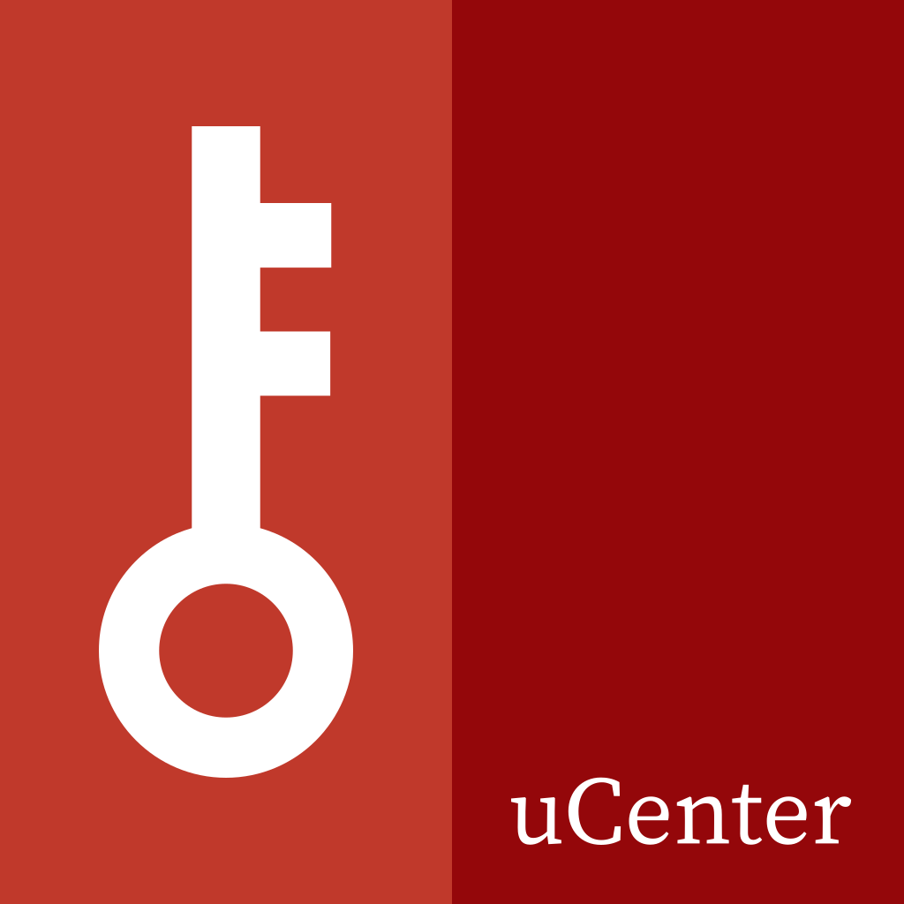

<div align="center">
  
</div>

# uCenter

> A simple, modern, and extensible user center.

[English](./README.md)
[中文](./README_zhs.md)

## Development

Please use \*nix system to develop this project. Windows is not supported.

You could use [DevContainer](https://code.visualstudio.com/docs/devcontainers/containers) to instantly start developing. As a special case, Github Codespaces should also work out of the box.

To set up the development environment manually, please follow the steps below:

### Setup Node.js

It's recommended to use [nvm](https://github.com/nvm-sh/nvm) to manage Node.js versions.
Please refer to their documentation for [installation steps](https://github.com/nvm-sh/nvm#install--update-script).

After installation, run the following command at workspace root to install the Node.js version specified in `.nvmrc`:

```bash
nvm install
```

Then, run the following command to enable [corepack](https://nodejs.org/api/corepack.html):

```bash
corepack enable
```

Which will set up the package manager for you.

### Install dependencies

Run the following command to install dependencies:

```bash
yarn
```

### Start developing packages

Each package is located in `packages/` directory. When playing with a package, you should use the following command:

```bash
yarn workspace <package-name> <command>
```

to run the command in the context of the package. For example, to develop the `@ucenter/server` package, you should execute the following commands:

```bash
yarn workspace @ucenter/server ts:build -w # Build the package in watch mode
yarn workspace @ucenter/server start       # Start the uCenter server
```

## Contributing

Please read [CONTRIBUTING.md](./CONTRIBUTING.md) for details on our code of conduct, and the process for submitting pull requests to us.
